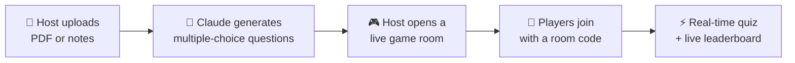
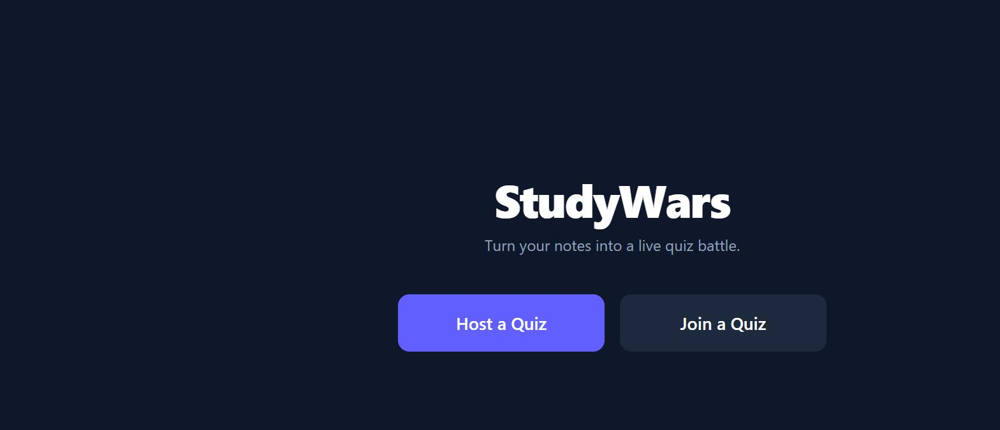
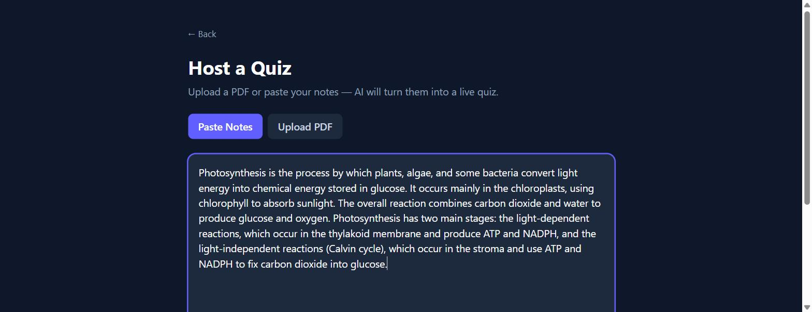
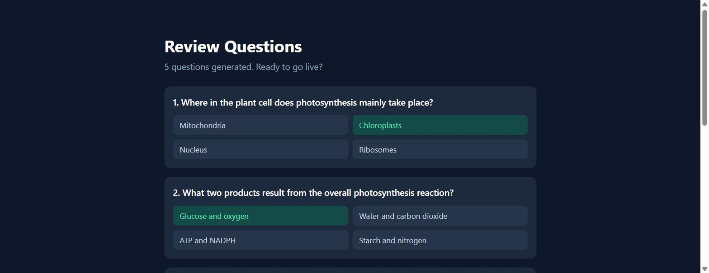
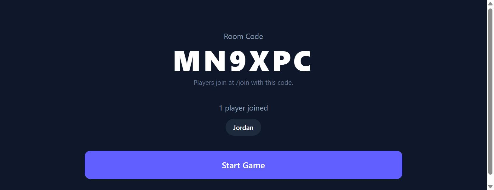
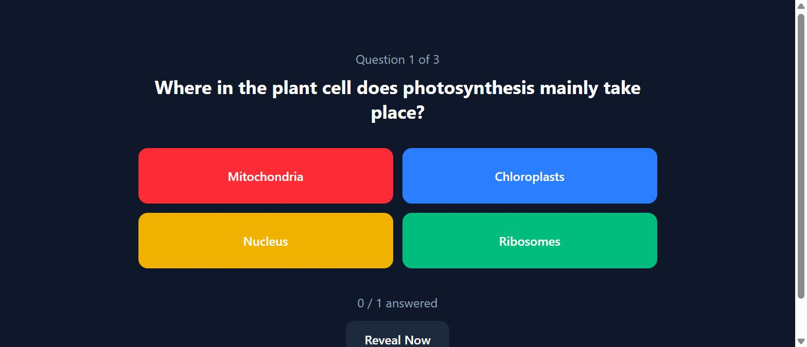
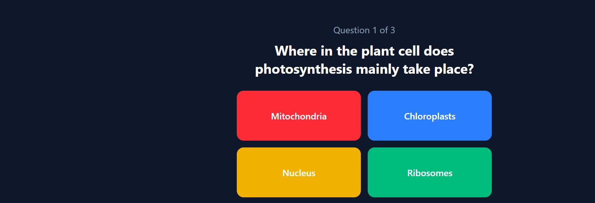
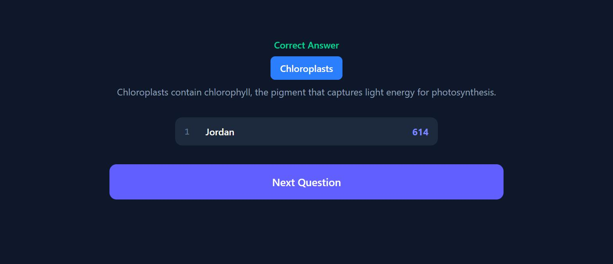
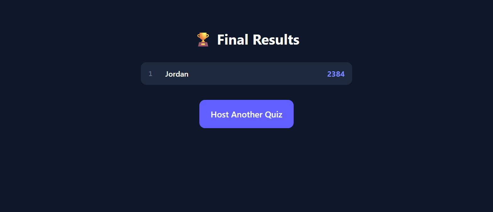
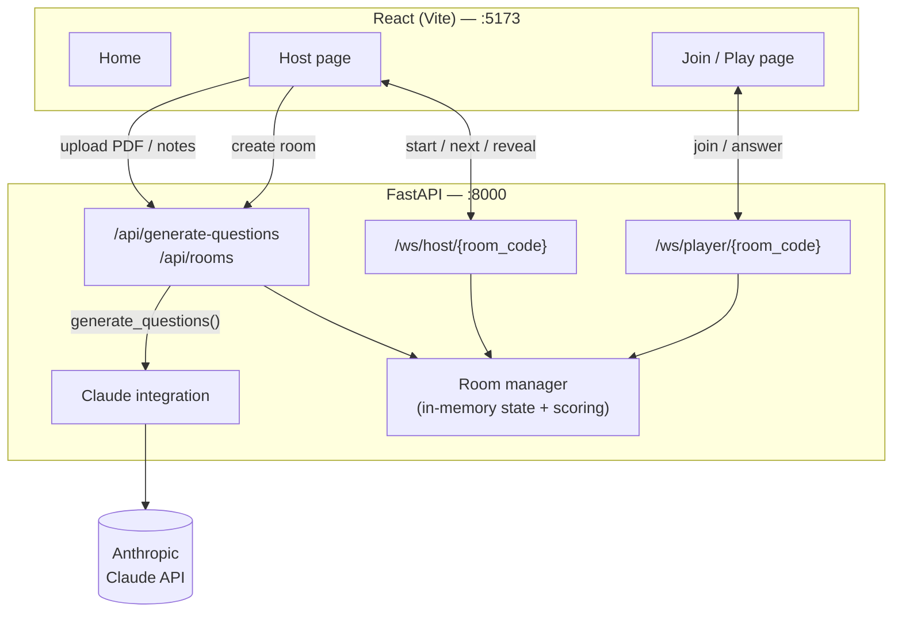

<div align="center">
  

  **Turn your notes into a live, multiplayer quiz in seconds.**

  Upload a PDF or paste your notes, let AI write the questions, and host a Kahoot style
  game your friends can join from their phones.

  [](https://www.python.org/)
  [](https://fastapi.tiangolo.com/)
  [](https://react.dev/)
  [](https://vitejs.dev/)
  [](https://tailwindcss.com/)
  [](https://www.anthropic.com/)
  [](LICENSE)

</div>

---

## Contents

- [How it works](#how-it-works)
- [Features](#features)
- [Screenshots](#screenshots)
- [Tech stack](#tech-stack)
- [Architecture](#architecture)
- [Getting started](#getting-started)
- [Playing a game](#playing-a-game)
- [API reference](#api-reference)
- [Project structure](#project-structure)
- [Roadmap](#roadmap)
- [Contributing](#contributing)
- [License](#license)

## How it works



1. **Host uploads a PDF or pastes notes.**
2. **AI reads the content** and generates multiple choice questions automatically.
3. **Host starts a live game room** and shares a short join code.
4. **Players join** from their phones or laptops — no account needed.
5. **Everyone answers in real time**, and the leaderboard updates after every question.

## Features

- 🧠 **AI-generated quizzes** — drop in a PDF or raw notes, get 1–20 multiple-choice questions back, powered by the Claude API.
- ⚡ **Real-time gameplay** — rooms, questions, reveals, and scoring are all pushed live over WebSockets.
- 🏆 **Live leaderboard** — scores update after every question so players can see where they stand.
- 📱 **No install for players** — join from any browser with a room code and a name.
- 🎛️ **Host controls** — start the game, reveal answers, and advance questions on your own pace.
- 🖥️ **Two synced views** — a big-screen host view for the room, and a lightweight player view for each device.

## Screenshots

| Home | Host setup | Review questions |
|:---:|:---:|:---:|
|  |  |  |

| Join a quiz | Host lobby | Live question |
|:---:|:---:|:---:|
|  |  |  |

| Player answering | leaderboard | Final results |
|:---:|:---:|:---:|
|  |  |  |

## Tech stack

| Layer | Tech |
|---|---|
| Backend | Python, [FastAPI](https://fastapi.tiangolo.com/), native WebSockets, [Anthropic Claude API](https://www.anthropic.com/) |
| Frontend | [React](https://react.dev/) (Vite), [React Router](https://reactrouter.com/), [Tailwind CSS](https://tailwindcss.com/) |
| PDF parsing | [pypdf](https://pypi.org/project/pypdf/) |
| Realtime | WebSockets (host + player channels per room) |
| State | In-memory room/game state on the server (no database required) |

## Architecture



The frontend never talks to Claude directly, the backend generates the questions, creates the
room, and then fans out live game state to every connected socket via the `Room` object in
`app/rooms.py`.

## Getting started

### Prerequisites

- [Python 3.11+](https://www.python.org/downloads/)
- [Node.js 18+](https://nodejs.org/) and npm
- A [Claude API key](https://console.anthropic.com/)

### 1. Clone the repo

```bash
git clone https://github.com/oree-xx/StudyWars.git
cd StudyWars
```

### 2. Backend setup

```bash
cd server
python -m venv venv
venv\Scripts\activate          # Windows
# source venv/bin/activate     # macOS/Linux

pip install -r requirements.txt

copy .env.example .env         # Windows
# cp .env.example .env         # macOS/Linux
```

Open `server/.env` and paste in your `ANTHROPIC_API_KEY`.

Run the backend:

```bash
uvicorn app.main:app --reload
```

It starts on `http://localhost:8000`. Check it's alive at `http://localhost:8000/health`.

### 3. Frontend setup

In a separate terminal:

```bash
cd client
npm install
npm run dev
```

It starts on `http://localhost:5173` and proxies `/api` and `/ws` requests through to the
backend automatically — no extra config needed.

## Playing a game

1. Open `http://localhost:5173`.
2. Click **Host a Quiz**, upload a PDF or paste some notes, pick a question count, and generate.
3. Share the room code that appears in the lobby.
4. On a second device (or another browser tab), click **Join a Quiz**, enter the code and a
   name.
5. Once everyone's in, the host starts the game — questions, reveals, and the leaderboard all
   sync live to every player.

## API reference

### HTTP

| Method | Path | Description |
|---|---|---|
| `GET` | `/health` | Liveness check. |
| `POST` | `/api/generate-questions` | Accepts a PDF file (`multipart/form-data`) or `notes` text plus `num_questions` (1–20); returns AI-generated multiple-choice questions. |
| `POST` | `/api/rooms` | Creates a game room from a list of questions; returns a `room_code` and a `host_token`. |

### WebSockets

| Path | Role | Notes |
|---|---|---|
| `/ws/host/{room_code}?token=...` | Host | Authenticated with the room's `host_token`. Sends `start_game`, `next_question`, `reveal_now`; receives room/player state. |
| `/ws/player/{room_code}?name=...` | Player | Joins the lobby by name. Sends `answer` with an `option_index`; receives live question, reveal, and leaderboard updates. |

## Project structure

```
server/                FastAPI backend
  app/
    main.py             App entrypoint, CORS, router wiring
    config.py            Settings (.env loading)
    ai.py                Claude integration (question generation)
    pdf_utils.py          PDF text extraction
    models.py             Question schema
    rooms.py               In-memory game/room state + scoring
    routers/
      questions.py          POST /api/generate-questions
      rooms.py                POST /api/rooms
      ws.py                     WebSocket endpoints (host + player)

client/                React frontend
  src/
    pages/               Home, Host, Join, Play
    components/
      host/                Setup form, lobby, live question, reveal, results
      play/                 Waiting screen, answer options, reveal
      Leaderboard.jsx        Shared leaderboard UI
    hooks/
      useGameSocket.js      WebSocket connection hook
    lib/
      api.js                REST API client
      ws.js                  WebSocket URL builders
      optionColors.js         Answer-option color mapping
```

## Roadmap

- [ ] Persist rooms/scores beyond process restarts
- [ ] Support image-based question generation (diagrams, slides)
- [ ] Per-question timers and speed bonuses
- [ ] Exportable results (CSV / share link)

## Contributing

Issues and pull requests are welcome. If you're adding a feature, please open an issue first to
discuss what you'd like to change.

## License

Distributed under the [MIT License](LICENSE).
